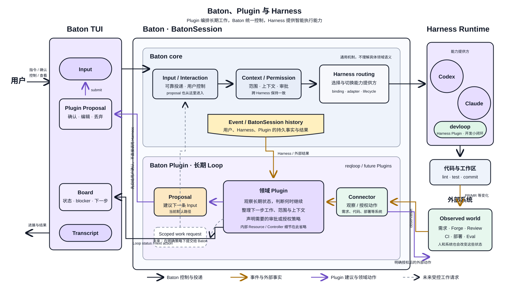
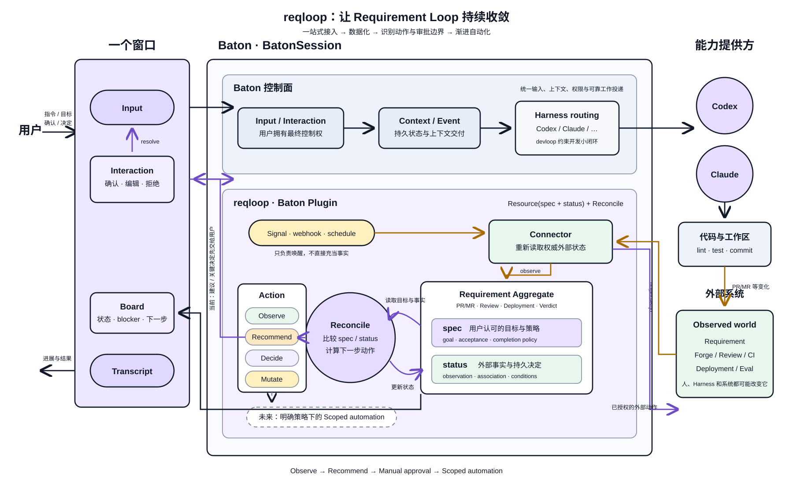

[English](./README.md)

# reqloop

reqloop 是面向 Requirement Loop 的官方 [Baton](https://github.com/compforge/baton)
Marketplace。它是一个多 Plugin 仓库：`plugins/` 下每个 Plugin 目录都是可独立版本化的
Baton PluginPackage，仓库根只负责 Marketplace 发现和公共开发约定。

## 架构概览

Baton Plugin 负责协调长期领域 Loop，但不直接调用 Harness。它通过 Baton 的常规输入、上下文、
权限和路由路径提出建议或提交范围明确的工作；Harness 作为智能执行能力提供方，devloop 等
Harness Plugin 则约束 Harness 内部的开发小闭环。



ReqLoop 当前接入需求平台、Forge 和 devloop observation，把外部状态和用户的持久决定整理为
Resource。下图同时包含 Delivery、Evaluation 和受控自动化等长期方向；这些阶段尚未全部实现。



目标开发使用流程是：

```text
开发 Plugin
  → 构建并校验 manifest
  → 将 Marketplace 或 Plugin link 到 Baton
  → 在 /plugins 中为当前 BatonSession 创建并启用 PluginInstance
  → 激活 PluginBinding
  → 使用 Command 与 Resource/Reconcile 工作流
  → Baton 重启后恢复同一条 loop
```

## 当前状态

本仓库随 Baton 的 Plugin host 与 per-Binding Runner 进程一起演进。Hello 验证最小 Package
生命周期，Hello Counter 和 Turn Coach 验证 Resource/Reconcile、Baton-owned Resource watch
和持久 Proposal；ReqLoop 协调 Workspace、Repository、PullRequest 和 Requirement 四种
Resource，并汇总需求平台、Forge 与 devloop observation。

## 在 Baton 中安装和使用

将本 Git 仓库注册为 Marketplace，并安装所需 Package：

```bash
baton plugins marketplace add https://github.com/compforge/reqloop.git
baton plugins install compforge/turn-coach --marketplace reqloop
baton plugins install compforge/reqloop --marketplace reqloop
baton plugins list
```

本地开发时，将 Git URL 换成本地 checkout 路径：

```bash
baton plugins marketplace add /path/to/reqloop
```

安装 Package 后，启动 `baton`，输入 `/plugins`，进入 **Installed**，选择对应 Package，再执行
**Enable in this session**。Turn Coach 会复盘已完成的 turn 并建议下一步；ReqLoop 会观察
Workspace 各 checkout 中的 devloop review 终态，对可处理 comments 只询问一次 accept 或
ignore，并仅在 accept 后提供一条驱动当前 Harness 修复的建议输入。

## 仓库结构

```text
.baton-plugin/marketplace.json  Marketplace 索引
plugins/<plugin-name>/          一份独立版本的 Baton Plugin
plugins/reqloop/AGENTS.md       ReqLoop 架构约束与设计索引
plugins/reqloop/docs/           ReqLoop 领域模型与 reconcile 细节
docs/baton-plugin-harness.*     Baton Plugin 与 Harness 关系图
docs/reqloop-workflow.*         ReqLoop 工作框图（SVG 与 PNG）
CONTRIBUTING.md                 新 Plugin 接入规则
AGENTS.md                       架构与维护约束
```

领域模型与 Connector 留在拥有它们的 Plugin 内。Baton core 只提供通用的 Package、Instance、
Binding、Resource/Controller 和 Proposal 契约。

## Plugins

- [Hello](./plugins/hello/README.md) — 用于验证 Marketplace 发现、安装和加载的最小 `0.1.0`
  Package。
- [Hello Counter](./plugins/hello-counter/README.md) — 演示可写 Resource 与
  `baton.turn` Controller 的组合。
- [Turn Coach](./plugins/turn-coach/README.md) — 验证 Baton-owned Resource replay、持久状态和
  proposed input 的端到端 canary。
- [ReqLoop](./plugins/reqloop/README.md) — 需求级闭环协调；`0.2.5` 物化 Requirement
  Resource，将活跃 Requirement 暴露为可搜索的 Harness context、通过 Repository
  Resource 发现 PullRequest，并只询问一次 PullRequest 是否关联 Requirement。

领域模型、reconcile、Connector 边界与长期方向见
[ReqLoop 架构索引](./plugins/reqloop/AGENTS.md)。

新增 Plugin 前请阅读 [CONTRIBUTING.md](./CONTRIBUTING.md)。
